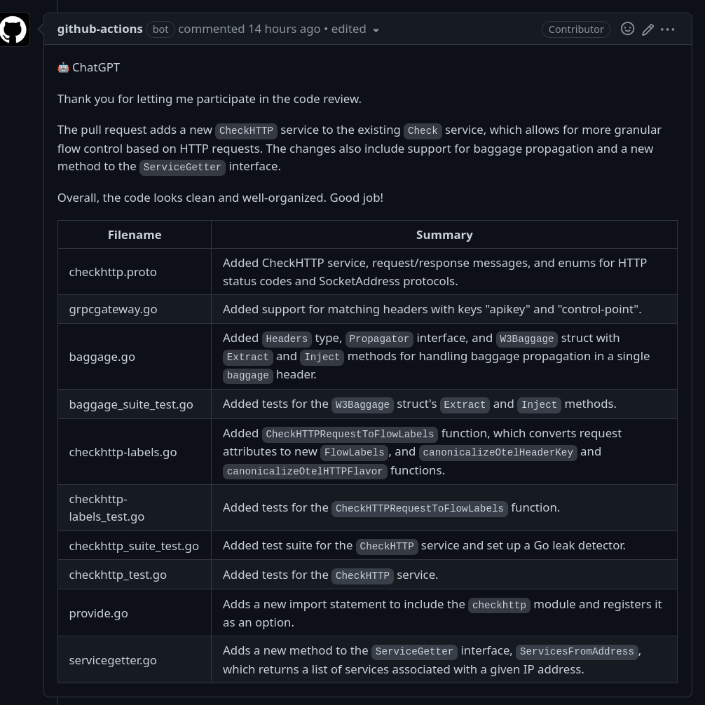
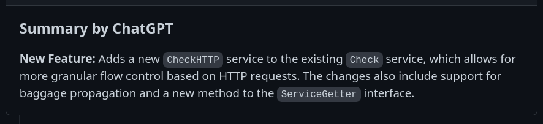
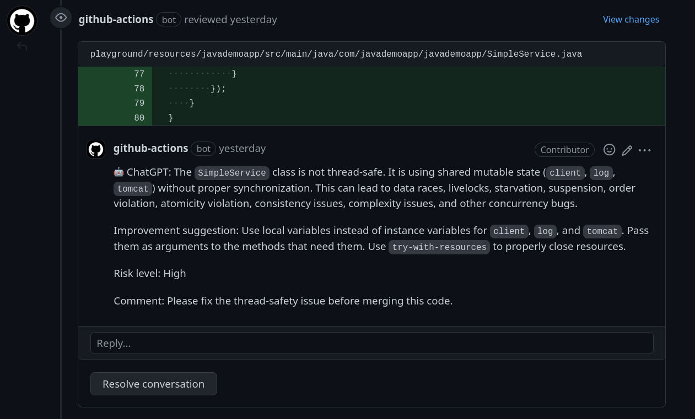
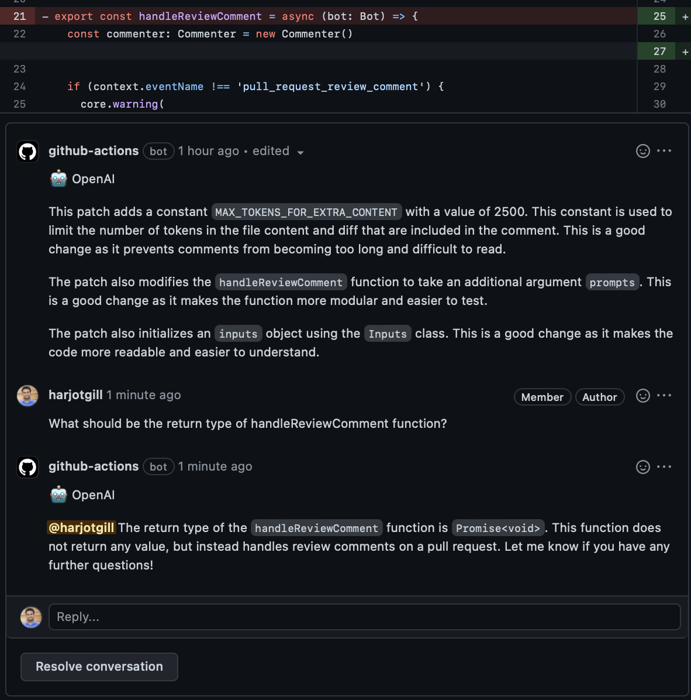

# OpenAI PR Reviewer & Summarizer

 

## ✨ Overview

A sleek, **AI‑powered GitHub Action** that reviews pull requests, generates concise summaries, and drafts release notes—all powered by OpenAI's GPT models. It runs automatically on each PR, giving you fast, high‑quality feedback without leaving your workflow.

## 🌟 Key Benefits
- **Instant PR Review** – Automated comments with actionable insights.
- **Smart Summaries** – One‑click overview of changes for reviewers.
- **Release‑Ready Notes** – Auto‑generated changelog snippets.
- **Zero Configuration** – Works out of the box with a simple YAML file.
- **Privacy‑First** – Only code diffs are sent to OpenAI; no repository secrets are exposed.

## 🚀 Quick Start (npm only)
1. **Add the workflow** to `.github/workflows/openai-pr-reviewer.yml`:
   ```yaml
   name: OpenAI PR Review
   on: [pull_request]
   jobs:
     review:
       runs-on: ubuntu-latest
       steps:
         - uses: fluxninja/openai-pr-reviewer@main
           env:
             GITHUB_TOKEN: ${{ secrets.GITHUB_TOKEN }}
             OPENAI_API_KEY: ${{ secrets.OPENAI_API_KEY }}
   ```
2. **Install dependencies** (run once in the repository root):
   ```bash
   npm install
   ```
3. **Build the action** (required before publishing):
   ```bash
   npm run build && npm run package
   ```
4. **Push** your changes. The action will trigger on every new PR.

> **Tip:** Enable `debug: true` in the workflow to see raw OpenAI request/response logs.

## 📖 Usage Details
- The action analyses the PR diff, sends it to OpenAI, and posts a review comment.
- You can customize the system prompt via the `system_message` input.
- Adjust `max_files` to limit the number of files examined (set to `0` for unlimited).
- Use `temperature` to control answer creativity (default `0.2`).

## 🎨 Screenshots
> *(Replace the placeholders with your own images)*





## ⚙️ Configuration Options
| Input | Description | Default |
|-------|-------------|---------|
| `debug` | Show raw OpenAI messages in CI logs | `false` |
| `max_files` | Max files to review (`0` = unlimited) | `0` |
| `review_comment_lgtm` | Post comment even when change is LGTM | `false` |
| `temperature` | Sampling temperature for GPT | `0.2` |
| `system_message` | Custom system prompt for the model | *Built‑in* |

## 🤝 Contributing
We welcome contributions! Fork the repo, make your changes, and submit a PR. Ensure you run:
```bash
npm test
npm run lint
```
You can reply to a review comment made by this action and get a response based
on the diff context. Additionally, you can invite the bot to a conversation by
mentioning it in the beginning of the comment with `@openai`.

Example:

> @openai Can you please review this block of code?

### Screenshots




#### Environment variables

- `GITHUB_TOKEN`: This should already be available to the GitHub Action
  environment. This is used to add comments to the pull request.
- `OPENAI_API_KEY`: use this to authenticate with OpenAI API. You can get one
  [here](https://platform.openai.com/account/api-keys). Please add this key to
  your GitHub Action secrets.

#### Inputs

- `debug`: Enable debug mode, will show messages and responses between OpenAI
  server in CI logs.
- `max_files`: Maximum number of files to be reviewed. Less than or equal to 0
  means no limit.
- `review_comment_lgtm`: Leave comments even the patch is LGTM
- `path_filters`: Rules to filter files to be reviewed.
- `temperature`: Temperature of the GPT-3 model.
- `system_message`: The message to be sent to OpenAI to start a conversation.

### Prompt templates:

See: [./action.yml](./action.yml)

Any suggestions or pull requests for improving the prompts are highly
appreciated.

## Developing

> First, you'll need to have a reasonably modern version of `node` handy, tested
> with node 16.

Install the dependencies

```bash
$ npm install
```

Build the typescript and package it for distribution

```bash
$ npm run build && npm run package
```

## FAQs

### Review pull request from forks

GitHub Actions limits the access of secrets from forked repositories. To enable
this feature, you need to use the `pull_request_target` event instead of
`pull_request` in your workflow file. Note that with `pull_request_target`, you
need extra configuration to ensure checking out the right commit:

```yaml
name: Code Review

permissions:
  contents: read
  pull-requests: write

on:
  pull_request_target:

jobs:
  review:
    runs-on: ubuntu-latest
    steps:
      - uses: fluxninja/openai-pr-reviewer@main
        env:
          GITHUB_TOKEN: ${{ secrets.GITHUB_TOKEN }}
          OPENAI_API_KEY: ${{ secrets.OPENAI_API_KEY }}
        with:
          debug: false
```

See also:
https://docs.github.com/en/actions/using-workflows/events-that-trigger-workflows#pull_request_target

### Inspect the messages between OpenAI server

Set `debug: true` in the workflow file to enable debug mode, which will show the
messages
